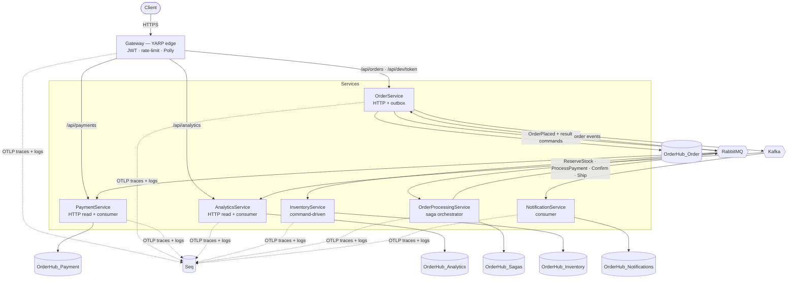
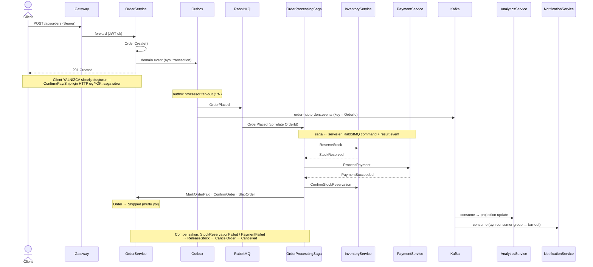
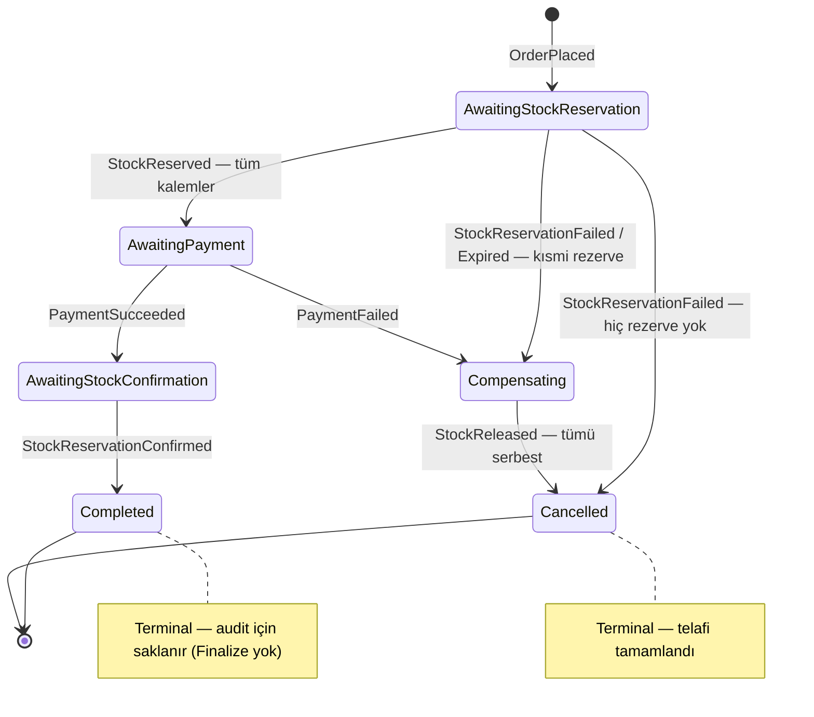

# OrderHub

[](https://github.com/suleymank12/OrderHub/actions/workflows/ci.yml)

> **.NET 8 event-driven e-commerce microservices** — Clean Architecture, CQRS, saga orchestration,
> transactional outbox, RabbitMQ + Kafka messaging, YARP gateway, Polly resilience ve OpenTelemetry
> distributed tracing üzerine kurulu, uçtan uca çalışan bir referans (showcase) sistemi.

**Status:** ✅ Phase 7 tamamlandı — tüm fazlar (1–7) `main`'de birleşti (#7). Build **0 warning / 0 error**, **418 test** yeşil, kalite kapısı (`check-acceptance.ps1`) **6/6**; canlı CI durumu için üstteki rozete bakın. Mülakat/CV-hazır referans sistemi.

---

## Overview

OrderHub, bir siparişin yaşam döngüsünü **altı bağımsız mikroservis + bir edge gateway** üzerinden
orkestre eden, olay güdümlü (event-driven) bir e-ticaret backend'idir. Sipariş oluşturma tek bir HTTP
çağrısıyla başlar; ardından **merkezi bir saga** (MassTransit state machine) stok rezervasyonu → ödeme →
onay/sevkiyat adımlarını sürer ve herhangi bir adım başarısız olursa **compensating transaction** ile
telafi eder (distributed transaction / 2PC yok). Servisler birbirine iki kanaldan bağlanır: kritik komutlar
**RabbitMQ** üzerinden (at-least-once, retry + DLQ, idempotent consumer), analitik/bildirim olayları ise
**Kafka** üzerinden (replay edilebilir event-log, bağımsız consumer group'larla fan-out). Veri-servis
tutarlılığı **transactional outbox** ile garanti altına alınır; her servis kendi veritabanına sahiptir
(database-per-service). Tüm trafik tek bir **YARP** edge'inden geçer (merkezi JWT + rate limiting + Polly
circuit breaker), ve yedi host'un tamamı **OpenTelemetry** ile Seq'e distributed trace yayar. Amaç: her
mimari kararı bir ADR'de yazılı, her satırı mülakatta savunulabilir, test edilebilir ve gözlemlenebilir bir
kod tabanı.

---

## Architecture

Sistem **yedi host**tan oluşur: altı iş servisi + bir YARP edge gateway. Altyapı olarak SQL Server (tek
instance, database-per-service), RabbitMQ, Kafka (KRaft mode) ve Seq bulunur.

| Host | HTTP API | Veritabanı | RabbitMQ | Kafka | Rol |
|------|:--------:|------------|:--------:|:-----:|-----|
| **Gateway** (YARP) | edge | — | — | — | Tek giriş: JWT, rate-limit, resilience, health dashboard |
| **OrderService** | ✅ | `OrderHub_Order` | ✅ | ✅ (producer) | Order aggregate, outbox, dev-token |
| **PaymentService** | ✅ (read-only) | `OrderHub_Payment` | ✅ | — | Ödeme işleme (RabbitMQ command consumer) |
| **AnalyticsService** | ✅ (read-only) | `OrderHub_Analytics` | — | ✅ (consumer) | CQRS read-model / projection |
| **InventoryService** | — | `OrderHub_Inventory` | ✅ | — | Stok rezervasyonu + Hangfire expiry |
| **OrderProcessingService** | — | `OrderHub_Sagas` | ✅ | — | Saga orchestrator (MassTransit state machine) |
| **NotificationService** | — | `OrderHub_Notifications` | — | ✅ (consumer) | Bildirim (ayrı consumer group → fan-out) |

Clean Architecture bağımlılık yönü sabittir: `Api → Application → Domain` ve
`Infrastructure → Application + Domain`. **Domain hiçbir katmana bağlı değildir.**

> **Diyagramlar:** Aşağıdaki üç diyagram (Mermaid — GitHub'da doğrudan render olur) sistemin **gerçek**
> topolojisini yansıtır: C4-stili container görünümü, olay akışı (sequence) ve saga state machine.

### C4 Container Diagram

Container görünümü — 7 host (6 servis + gateway), 2 broker, database-per-service ve Seq. _(C4-stili;
GitHub uyumu için `flowchart` ile çizildi — Mermaid'in native C4 desteği deneysel olduğundan.)_



### Event Flow (Sequence)

Bir siparişin uçtan uca akışı (gerçek topoloji):

1. Client → **Gateway** (`:8000`, JWT doğrulanır) → `POST /api/orders` → **OrderService** siparişi oluşturur.
2. OrderService, domain event'ini **transactional outbox**'a yazar; outbox processor iki hedefe yayar:
   - **RabbitMQ (command yolu):** `OrderPlaced` → **Saga** başlar → `ReserveStock` (Inventory) →
     `ProcessPayment` (Payment) → `ConfirmStockReservation` + `MarkOrderPaid`/`ConfirmOrder`/`ShipOrder`
     komutları OrderService'e geri gönderilir. Mutlu yol → **Shipped**; başarısızlık → compensation → **Cancelled**.
   - **Kafka (event yolu):** `order-hub.orders.events` (key = `OrderId`) → **AnalyticsService** (projection
     güncellenir) **ve** **NotificationService** (ayrı consumer group, tam fan-out).



### Saga State Machine

`OrderProcessingSaga` altı state içerir:
`AwaitingStockReservation → AwaitingPayment → AwaitingStockConfirmation → Completed`; telafi dalları
`Compensating → Cancelled`. Terminal state'ler (Completed/Cancelled) audit için saklanır (Finalize yok).



> **★ Dürüst tasarım notu (HTTP domain seam).** Client yalnızca `POST /api/orders` çağırır.
> `Confirm` / `Pay` / `Ship` için **HTTP endpoint YOKTUR** — bu state geçişleri client tarafından değil,
> **saga tarafından RabbitMQ command'leriyle** sürülür (sipariş oluşturma `OrderPlaced` yayımlar, saga
> onu alıp süreci orkestre eder). Bu bilinçli bir karardır: süreç otoritesi tek bir state machine'de
> toplanır (bkz. [ADR-0007](docs/adr/0007-saga-orchestration.md)). Dolayısıyla README'de "POST /confirm"
> gibi bir uç göremezsiniz — çünkü yoktur.

---

## Tech Stack

| Katman | Teknoloji | Rol |
|--------|-----------|-----|
| Runtime / API | **.NET 8 (LTS)**, ASP.NET Core Web API (Controllers) | HTTP host'ları |
| CQRS | **MediatR 12** | Command / query ayrımı, pipeline behavior'lar |
| Validation | **FluentValidation 11** | Application katmanında input doğrulama |
| Mapping | **Mapster** | DTO ↔ domain eşleme (AutoMapper değil — performans) |
| Persistence | **EF Core 8** + **SQL Server 2022** | Database-per-service |
| Command bus + Saga | **MassTransit 8** + **RabbitMQ 3.13** | Command messaging, saga state machine, retry + DLQ |
| Event streaming | **Confluent.Kafka** + **Kafka (cp-7.6.1, KRaft)** | Replay edilebilir event-log, consumer fan-out |
| Reliability | **Transactional Outbox + Inbox** | Atomik publish, idempotent consumer |
| Background jobs | **Hangfire** (SQL Server storage) | Zamanlanmış / recurring işler (ör. reservation expiry) |
| API Gateway | **YARP 2** | Tek edge, merkezi JWT, rate limiting, CORS |
| Resilience | **Polly 8** (Microsoft.Extensions.Http.Resilience) | Retry (idempotent-only), circuit breaker, timeout |
| Logging | **Serilog → Seq** | Structured logging, correlation ID |
| Tracing | **OpenTelemetry** (OTLP → Seq) | 7 host + 2 broker distributed tracing |
| Testing | **xUnit · Moq · FluentAssertions · AutoFixture · Testcontainers** | Unit + integration + e2e |
| Container | **Docker Compose (v2)** | Tüm stack tek komutla |

---

## Quick Start

### Prerequisites

- [Docker Desktop](https://www.docker.com/products/docker-desktop/) (Compose v2 dahil)
- [.NET 8 SDK](https://dotnet.microsoft.com/download/dotnet/8.0) — yalnızca lokal build/test için
  (sadece `docker compose up` çalıştıracaksan SDK'ya gerek yok)
- PowerShell 7+ (`pwsh`) — coverage ve kontrol script'leri için (cross-platform)

### 1) Repo'yu klonla ve şablonları kopyala

```bash
git clone <repo-url> OrderHub && cd OrderHub

# Secret şablonu (gitignored .env olur) — SQL_SA_PASSWORD, JWT_SECRET, RABBITMQ_* değerlerini DEĞİŞTİR
cp docker/.env.example docker/.env

# Local port mapping şablonu (gitignored override olur) — gateway :8000 + downstream port'ları açar
cp docker/docker-compose.override.yml.example docker/docker-compose.override.yml
```

Ana `docker-compose.yml`'de bilinçli olarak **published port yoktur** (servisler yalnızca internal
`orderhub` ağında konuşur, prod-benzeri). Host erişimi yalnızca yukarıdaki override ile açılır.

### 2) Stack'i ayağa kaldır

```bash
cd docker && docker compose up -d --build
```

Yedi host (6 servis + gateway) + altyapı (SQL Server, RabbitMQ, Kafka, Seq) ayağa kalkar. Tüm API
trafiği **gateway edge'inden** (`:8000`) geçer.

| Servis | URL |
|--------|-----|
| **Gateway (edge — tek giriş)** | http://localhost:8000 |
| **Health dashboard** (6 servis) | http://localhost:8000/health-ui |
| OrderService Swagger | http://localhost:8080/swagger |
| PaymentService Swagger (read-only) | http://localhost:8082/swagger |
| AnalyticsService Swagger (read-only) | http://localhost:8083/swagger |
| **Seq** (loglar + trace) | http://localhost:8081 |
| RabbitMQ Management UI | http://localhost:15672 |
| Kafka UI | http://localhost:8088 |

> Downstream Swagger port'ları (8080/8082/8083) yalnızca **dev convenience** içindir (doğrudan debug);
> prod'da yalnızca gateway edge'i dışa açılır, downstream'ler internal kalır (dokümante sınır).

### 3) Token al → sipariş oluştur (gateway üzerinden)

```bash
# a) Development-only token (anonymous route, gateway → OrderService)
curl -s -X POST http://localhost:8000/api/dev/token \
     -H "Content-Type: application/json" -d '{}'
# → { "token": "<JWT>", "expiresAtUtc": "..." }

# b) Sipariş oluştur (Bearer) — gateway → OrderService → saga akışını başlatır
curl -X POST http://localhost:8000/api/orders \
     -H "Authorization: Bearer <JWT>" \
     -H "Content-Type: application/json" \
     -d '{
       "shippingAddress": { "street": "Bağdat Cad. 1", "city": "İstanbul", "postalCode": "34000", "country": "TR" },
       "items": [
         { "productId": "3fa85f64-5717-4562-b3fc-2c963f66afa6", "quantity": 2,
           "unitPrice": { "amount": 150.00, "currency": "TRY" } }
       ]
     }'
# → 201 Created, Location: /api/orders/{id}
```

Sipariş oluşturulduğunda saga (OrderProcessingService) `OrderPlaced` event'iyle tetiklenir ve süreci
otomatik sürer; siparişin durumu `GET http://localhost:8000/api/orders/{id}` ile,
akışı ise **Seq**'te (log + trace) izlenebilir.

### API Collection (Postman)

Tüm endpoint'ler için hazır collection: [`postman/`](postman/). Import et → **OrderHub Local** environment'ını
seç → **Dev Token** → **Create Order** akışını çalıştır (`{{token}}`/`{{orderId}}` otomatik set edilir).
Bruno/Insomnia bu collection'ı doğrudan import eder. ★ Dürüst akış sınırı ([ADR-0007](docs/adr/0007-saga-orchestration.md)):
`Confirm`/`Pay` HTTP'de yok — saga otomatik sürer, collection'da uydurma istek yok.

---

## Project Structure

```
OrderHub/
├── src/
│   ├── BuildingBlocks/
│   │   ├── OrderHub.Common/          # Result<T>, DomainException, Entity/AggregateRoot primitifleri
│   │   ├── OrderHub.Contracts/       # Servisler arası paylaşılan integration event kontratları
│   │   ├── OrderHub.EventBus/        # RabbitMQ (MassTransit) + Kafka (Confluent) publish soyutlamaları
│   │   ├── OrderHub.Outbox/          # Transactional outbox (EF interceptor + processor)
│   │   ├── OrderHub.Inbox/           # Idempotent consumer (inbox dedup)
│   │   └── OrderHub.Observability/   # Serilog + OpenTelemetry ortak wiring
│   ├── Services/
│   │   ├── OrderService/             # Api · Application · Domain · Infrastructure
│   │   ├── PaymentService/           # Api · Application · Domain · Infrastructure
│   │   ├── AnalyticsService/         # Api · Application · Domain · Infrastructure (CQRS read-side)
│   │   ├── InventoryService/         # Api · Application · Domain · Infrastructure
│   │   ├── NotificationService/      # Api · Application · Domain · Infrastructure
│   │   └── OrderProcessingService/   # Api · Infrastructure (saga orchestrator — domain aggregate yok)
│   └── Gateway/
│       └── OrderHub.Gateway/         # YARP saf-edge (hiçbir servise ProjectReference yok)
├── tests/                            # 18 test projesi (unit + Testcontainers integration + e2e)
├── docs/
│   ├── adr/                          # Architecture Decision Records (0001–0009)
│   └── pr/                           # Faz kapanış notları (phase-3 … phase-7)
├── docker/                           # docker-compose.yml + .env.example + override.yml.example
├── scripts/                          # check-acceptance.ps1 (faz kalite kapısı) + coverage.ps1
├── CLAUDE.md                         # Proje mutlak kuralları (K1–K5)
└── ROADMAP.md                        # Faz planı ve kabul kriterleri
```

---

## Testing

Toplam **418 test** (Phase 6 itibarıyla), build **0 warning / 0 error**. Test piramidi:

- **Unit** — domain aggregate'leri, value object'ler, handler'lar (Moq + FluentAssertions + AutoFixture).
- **Integration** — **Testcontainers** ile gerçek SQL Server / RabbitMQ / Kafka container'ları +
  `WebApplicationFactory`. Outbox/inbox, saga (happy + compensation), Kafka consumer dedup, gateway
  routing/CB/retry gibi kritik akışlar gerçek altyapıyla kanıtlanır.
- **E2E / trace** — saga uçtan uca (gerçek RabbitMQ + SQL) ve Kafka trace propagation (gerçek Kafka).

```powershell
dotnet build OrderHub.sln           # Solution'ı derle (0 warning hedefi)
dotnet test  OrderHub.sln           # Tüm testleri çalıştır

.\scripts\coverage.ps1              # Coverage topla + HTML rapor (coverage/html/index.html — gitignored)
.\scripts\check-acceptance.ps1      # Faz geçiş kalite kapısı
```

**Faz geçiş kapısı** (`check-acceptance.ps1`) altı kontrol koşar: **K1** (400 satır kuralı) · **K3**
(hardcoded secret taraması) · **LOCK** (`packages.lock.json` bütünlüğü) · **BUILD** (0 warn/err) ·
**TEST** (0 fail) · **DOCKER** (compose syntax). CI bunu tek satırla çağırabilir.

> **Not:** Kapıdaki TEST adımı integration projelerini **proje-proje sıralı** koşar. Sebep:
> `dotnet test <sln>` tüm assembly'leri paralel koşar → altı integration projesi aynı anda
> Testcontainers (SQL/RabbitMQ/Kafka) kaldırınca Docker/makine over-subscribe olur → kapasite kaynaklı
> flake. Sıralı koşum aynı anda yalnız tek projenin container'larını kaldırır → güvenilir.

---

## Roadmap / Future Work

Aşağıdakiler **bilinçli** olarak sonraki iterasyonlara bırakılmıştır (gizli TODO değil, dokümante sınır):

- **Metrics (Prometheus / Grafana).** Distributed **tracing** tamamlandı (OpenTelemetry, 7 host + 2 broker
  → Seq). **Metrics** bilinçli olarak ertelendi — mimari hazır (OTel SDK tüm host'larda kurulu); eklenecek
  olan yalnızca `/metrics` Prometheus exporter + instrumentation ve Grafana dashboard'larıdır
  (bkz. [ADR-0008](docs/adr/0008-gateway-edge-and-observability.md) ve ROADMAP §6.7).
- **Uçtan uca tek-trace.** Asenkron outbox publish'i trace'i segmentlere böler (bir sipariş = birden çok
  trace-id); her hop kendi segmentinde kesintisiz. Tam zincir için outbox'a `traceparent` saklama
  gerekir (follow-up).
- **Caching (Redis).** Kilitli stack'te (CLAUDE.md §3) yer alır ancak henüz devreye alınmadı — okuma
  yoğun projection sorguları için ileride eklenebilir.
- **Server-side pricing.** `CreateOrderItemRequest.UnitPrice` şu an client'tan gelir (catalog/pricing
  servisi yok); sunucu tarafına taşınması planlıdır.

---

## Architecture Decisions

Önemli mimari kararlar ve gerekçeleri [`docs/adr/`](docs/adr/) altında ADR formatında tutulur —
"bunu neden böyle yaptık?" sorusunun cevabı kodun değil, yazılı kararın içindedir. Güncel liste ve
özet için [ADR index'i](docs/adr/README.md) inceleyin.

## Project Rules & Roadmap

- **Proje kuralları:** [`CLAUDE.md`](CLAUDE.md) — ihlal edilemez kurallar (K1–K5) ve kodlama standartları.
- **Faz planı:** [`ROADMAP.md`](ROADMAP.md) — fazlar, kapsam ve kabul kriterleri.
